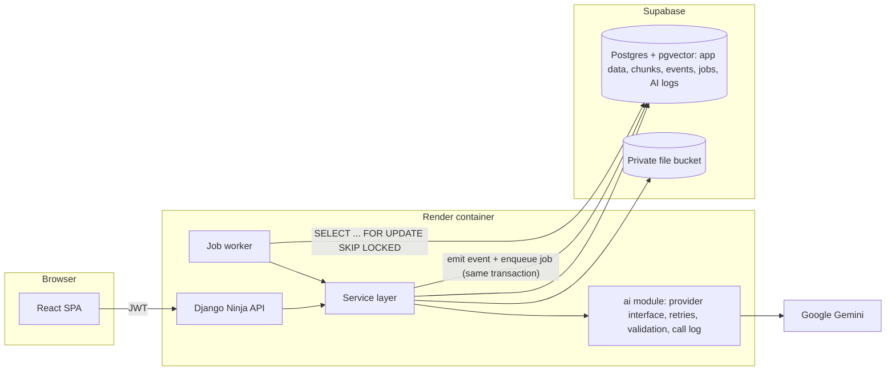
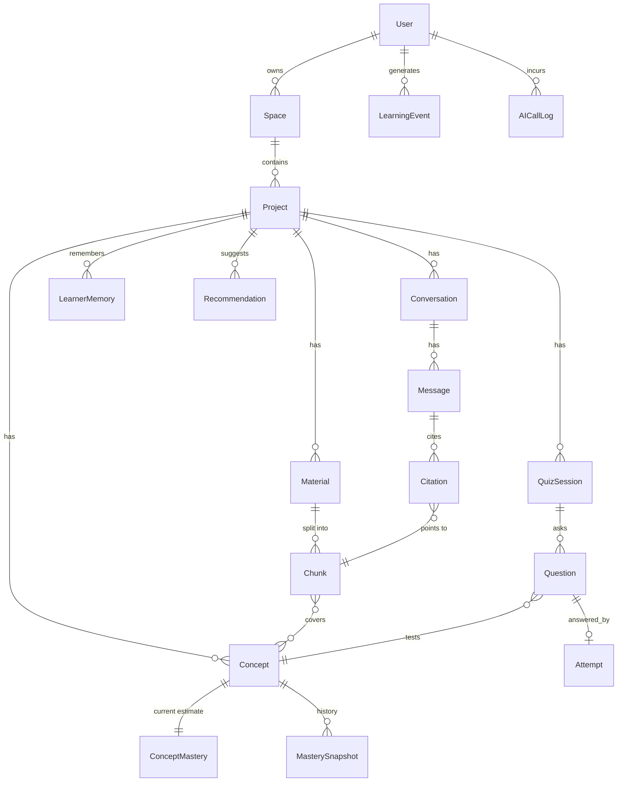

# Phase 8 — Deployment, Documentation and Submission (Tasks 39–43)

> **For agentic workers:** REQUIRED SUB-SKILL: Use superpowers:subagent-driven-development (recommended) or superpowers:executing-plans to implement this plan task-by-task. Steps use checkbox (`- [ ]`) syntax for tracking.

**Goal:** The app runs at a public URL on free hosting, the repository contains every document the challenge asks for, and a demo video walks the full learning loop.

**Spec:** `docs/superpowers/specs/2026-09-17-ai-study-companion-design.md` (section 16)
**Contract:** `00-overview.md`
**Depends on:** every earlier phase that was completed. This phase works even if Phase 6 or 7 was cut; skip the steps that mention a missing feature and record the cut in `docs/LIMITATIONS.md`.

> Tasks 40 and 41 need accounts that only the project owner can create (Supabase, Render, Vercel, GitHub). An agent prepares the files and the exact values; the owner performs the dashboard steps. Never paste a secret into a file that git tracks.

---

### Task 39: Production configuration and container

**Files:**
- Create: `backend/config/storage.py`, `backend/config/tests/{__init__,test_storage}.py`
- Create: `backend/Dockerfile`, `backend/start.sh`, `backend/.dockerignore`, `render.yaml`, `frontend/vercel.json`
- Modify: `backend/config/settings.py` (storage, security), `.env.example`

**Interfaces:**
- Produces: `config.storage.build_storages(env: Mapping[str, str]) -> dict`; a container whose `start.sh` runs migrations, the job worker and the web server.

- [ ] **Step 1: Write the failing test**

```bash
mkdir -p backend/config/tests && touch backend/config/tests/__init__.py
```

`backend/config/tests/test_storage.py`:
```python
import pytest
from django.core.exceptions import ImproperlyConfigured

from config.storage import build_storages

S3_ENV = {
    "STORAGE_BACKEND": "s3",
    "S3_ENDPOINT_URL": "https://ref.storage.supabase.co/storage/v1/s3",
    "S3_BUCKET": "materials",
    "S3_ACCESS_KEY": "key",
    "S3_SECRET_KEY": "secret",
    "S3_REGION": "ap-south-1",
}


def test_local_storage_is_the_default():
    storages = build_storages({})
    assert storages["default"]["BACKEND"] == "django.core.files.storage.FileSystemStorage"
    assert "staticfiles" in storages


def test_s3_storage_is_private_and_never_overwrites():
    options = build_storages(S3_ENV)["default"]["OPTIONS"]
    assert build_storages(S3_ENV)["default"]["BACKEND"] == "storages.backends.s3.S3Storage"
    assert options["bucket_name"] == "materials"
    assert options["endpoint_url"] == S3_ENV["S3_ENDPOINT_URL"]
    assert options["default_acl"] is None
    assert options["file_overwrite"] is False
    assert options["querystring_auth"] is True
    assert options["addressing_style"] == "path"


@pytest.mark.parametrize("missing", ["S3_ENDPOINT_URL", "S3_BUCKET", "S3_ACCESS_KEY", "S3_SECRET_KEY"])
def test_s3_storage_requires_every_setting(missing):
    env = {key: value for key, value in S3_ENV.items() if key != missing}
    with pytest.raises(ImproperlyConfigured, match=missing):
        build_storages(env)


def test_unknown_backend_is_rejected():
    with pytest.raises(ImproperlyConfigured):
        build_storages({"STORAGE_BACKEND": "ftp"})
```

Run: `cd backend && pytest config/tests -v`
Expected: FAIL — `ModuleNotFoundError: No module named 'config.storage'`.

- [ ] **Step 2: Write the storage builder**

`backend/config/storage.py`:
```python
from collections.abc import Mapping

from django.core.exceptions import ImproperlyConfigured

STATICFILES = {"BACKEND": "whitenoise.storage.CompressedStaticFilesStorage"}


def build_storages(env: Mapping[str, str]) -> dict:
    """Local disk for development; an S3-compatible private bucket (Supabase Storage) in production."""
    backend = env.get("STORAGE_BACKEND", "local")
    if backend == "local":
        return {"default": {"BACKEND": "django.core.files.storage.FileSystemStorage"}, "staticfiles": STATICFILES}
    if backend != "s3":
        raise ImproperlyConfigured(f"STORAGE_BACKEND must be 'local' or 's3', not '{backend}'")
    for name in ("S3_ENDPOINT_URL", "S3_BUCKET", "S3_ACCESS_KEY", "S3_SECRET_KEY"):
        if not env.get(name):
            raise ImproperlyConfigured(f"{name} is required when STORAGE_BACKEND=s3")
    return {
        "default": {
            "BACKEND": "storages.backends.s3.S3Storage",
            "OPTIONS": {
                "bucket_name": env["S3_BUCKET"],
                "endpoint_url": env["S3_ENDPOINT_URL"],
                "access_key": env["S3_ACCESS_KEY"],
                "secret_key": env["S3_SECRET_KEY"],
                "region_name": env.get("S3_REGION") or "us-east-1",
                "addressing_style": "path",
                "signature_version": "s3v4",
                "default_acl": None,          # the bucket stays private
                "querystring_auth": True,
                "file_overwrite": False,
            },
        },
        "staticfiles": STATICFILES,
    }
```

In `backend/config/settings.py`, replace the `STORAGES = {...}` block with:
```python
from config.storage import build_storages  # noqa: E402

STORAGES = build_storages(os.environ)
```
and add at the end of the file:
```python
# Production hardening. Render terminates TLS and forwards the original scheme in this header.
if not DEBUG:
    SECURE_PROXY_SSL_HEADER = ("HTTP_X_FORWARDED_PROTO", "https")
    SECURE_SSL_REDIRECT = True
    SECURE_REDIRECT_EXEMPT = [r"^api/health$"]      # the platform health check uses plain HTTP
    SECURE_HSTS_SECONDS = 60 * 60 * 24 * 30
    SECURE_CONTENT_TYPE_NOSNIFF = True
    SESSION_COOKIE_SECURE = True
    CSRF_COOKIE_SECURE = True
    DATABASES["default"]["CONN_HEALTH_CHECKS"] = True
```

Run: `pytest config/tests -v && pytest -q`
Expected: all pass.

- [ ] **Step 3: Write the container files**

`backend/Dockerfile`:
```dockerfile
FROM python:3.12-slim

ENV PYTHONDONTWRITEBYTECODE=1 \
    PYTHONUNBUFFERED=1 \
    PIP_NO_CACHE_DIR=1

WORKDIR /app
COPY requirements.txt .
RUN pip install -r requirements.txt

COPY . .
RUN chmod +x start.sh && useradd --create-home app && chown -R app:app /app
USER app

CMD ["./start.sh"]
```

`backend/start.sh`:
```bash
#!/usr/bin/env bash
set -euo pipefail

python manage.py migrate --noinput
python manage.py collectstatic --noinput

# The free tier has no separate worker service, so the job worker shares this container.
# Jobs live in Postgres: if this container sleeps or restarts, queued work is still there when it wakes.
(
  while true; do
    python manage.py run_worker || true
    echo "worker exited; restarting in 5 seconds"
    sleep 5
  done
) &

# One process with threads keeps memory under the 512 MB limit. AI calls are I/O bound, so threads suit them.
exec gunicorn config.wsgi:application \
  --bind "0.0.0.0:${PORT:-8000}" \
  --workers 1 --threads 8 --timeout 120 \
  --access-logfile - --error-logfile -
```

`backend/.dockerignore`:
```
.venv
__pycache__
*.pyc
.pytest_cache
media
staticfiles
.env
```

`render.yaml` (repository root):
```yaml
services:
  - type: web
    name: ai-study-companion-api
    runtime: docker
    plan: free
    rootDir: backend
    dockerfilePath: ./Dockerfile
    healthCheckPath: /api/health
    envVars:
      - key: DJANGO_DEBUG
        value: "false"
      - key: DJANGO_SECRET_KEY
        generateValue: true
      - key: AI_PROVIDER
        value: gemini
      - key: STORAGE_BACKEND
        value: s3
      - key: ALLOWED_HOSTS
        sync: false
      - key: CORS_ALLOWED_ORIGINS
        sync: false
      - key: DATABASE_URL
        sync: false
      - key: GEMINI_API_KEY
        sync: false
      - key: AI_MODEL_FAST
        sync: false
      - key: AI_MODEL_STRONG
        sync: false
      - key: AI_MODEL_EMBED
        sync: false
      - key: TUTOR_MIN_SIMILARITY
        sync: false
      - key: S3_ENDPOINT_URL
        sync: false
      - key: S3_BUCKET
        sync: false
      - key: S3_ACCESS_KEY
        sync: false
      - key: S3_SECRET_KEY
        sync: false
      - key: S3_REGION
        sync: false
      - key: DEMO_PASSWORD
        sync: false
      - key: ADMIN_PASSWORD
        sync: false
```

`frontend/vercel.json` (client-side routes must all serve `index.html`):
```json
{ "rewrites": [{ "source": "/(.*)", "destination": "/index.html" }] }
```

- [ ] **Step 4: Check the production path locally without Docker**

```bash
cd backend
DJANGO_DEBUG=false DJANGO_SECRET_KEY=local-check ALLOWED_HOSTS=localhost PORT=8001 ./start.sh
```
In a second terminal:
```bash
curl -s localhost:8001/api/health
```
Expected: `{"status": "ok"}`, and the first terminal shows `Worker started`. Stop it with Ctrl-C.

- [ ] **Step 5: Commit**

```bash
cd .. && git add backend render.yaml frontend/vercel.json .env.example
git commit -m "chore: add production storage and security settings, Dockerfile, start script and deploy configs

Co-Authored-By: Claude Fable 5.1 <noreply@anthropic.com>"
```

---

### Task 40: Database, storage and API deployment

**Files:** none in the repository. This task produces a live API URL.

- [ ] **Step 1: Publish the repository (owner)**

Confirm no secret is tracked, then push:
```bash
git log --all --full-history -- .env backend/.env frontend/.env | head -1    # expected: no output
git grep -nE "AIza[0-9A-Za-z_-]{20,}|sk-[A-Za-z0-9]{20,}" -- . ':!docs' || echo "no keys found"
gh repo create ai-study-companion --public --source . --push
```
If `gh` is not signed in, run `gh auth login` first.

- [ ] **Step 2: Create the Supabase project (owner)**

1. Create a project at supabase.com. Choose the region closest to the Render region you will use. Save the database password.
2. SQL Editor → run `create extension if not exists vector;`
3. Storage → New bucket → name `materials`, **Public bucket off**.
4. Storage → Settings → S3 Connection → enable it and create an access key. Note the endpoint URL, the region, the access key ID and the secret.
5. Project Settings → Database → Connection string → **Session pooler** (it supports IPv4, which Render needs). Copy the URI and append `?sslmode=require`.

Use the session pooler, not the transaction pooler: the job queue relies on `SELECT … FOR UPDATE SKIP LOCKED` inside a transaction, and Django keeps connections open.

- [ ] **Step 3: Run the migrations against Supabase from your machine**

```bash
cd backend && source .venv/bin/activate
DATABASE_URL='<session pooler URI>?sslmode=require' python manage.py migrate
DATABASE_URL='<session pooler URI>?sslmode=require' python manage.py shell -c "from django.db import connection; c=connection.cursor(); c.execute(\"select extversion from pg_extension where extname='vector'\"); print(c.fetchone())"
```
Expected: migrations apply cleanly and a vector version prints.

- [ ] **Step 4: Deploy the API on Render (owner)**

1. Render dashboard → New → Blueprint → select the repository. Render reads `render.yaml`.
2. Fill in the values marked `sync: false`: `DATABASE_URL`, `GEMINI_API_KEY`, the three model IDs from your local `.env`, `TUTOR_MIN_SIMILARITY` (the value tuned in Phase 7, or `0.55`), the five `S3_*` values, `DEMO_PASSWORD`, `ADMIN_PASSWORD`. Set `ALLOWED_HOSTS` to the Render hostname (for example `ai-study-companion-api.onrender.com`). Leave `CORS_ALLOWED_ORIGINS` as `http://localhost:5173` until Task 41.
3. Deploy and watch the logs. Expected lines: migrations `OK`, `Worker started`, gunicorn `Listening at`.

- [ ] **Step 5: Verify the live API**

```bash
API=https://<your-service>.onrender.com
curl -s $API/api/health                                   # {"status": "ok"}
curl -s -o /dev/null -w "%{http_code}\n" $API/api/spaces   # 401
```
Create the accounts from the Render shell, or locally with the production `DATABASE_URL`:
```bash
python manage.py seed_demo          # Phase 7, Task 38. If Phase 7 was cut, use: python manage.py createsuperuser
```

- [ ] **Step 6: Record the deployment**

Add the API URL to the "Deployment" section of `README.md` (written in Task 42) and commit with the next task.

---

### Task 41: Frontend deployment and production smoke test

- [ ] **Step 1: Deploy on Vercel (owner)**

1. Vercel → Add New Project → import the repository. Set **Root Directory** to `frontend`. The Vite preset is detected.
2. Environment variable: `VITE_API_URL=https://<your-service>.onrender.com` (no trailing slash, no `/api`).
3. Deploy and note the URL.

- [ ] **Step 2: Allow the frontend origin**

In Render, set `CORS_ALLOWED_ORIGINS=https://<your-app>.vercel.app` and redeploy.

- [ ] **Step 3: Production smoke test (the demo path)**

On the Vercel URL, in a private window:
1. Register a new user. Create a Space and a Project.
2. Upload a small text PDF. It reaches `ready`. Reload the page during processing; the status continues to update.
3. Upload a scanned PDF (or a PDF exported from a photo). It reaches `ready`, which proves the OCR path.
4. Ask the Tutor a question the PDF answers. The reply has a citation chip; the chip opens the PDF at that page.
5. Ask a question the PDF cannot answer. The reply is the "Not in your materials" card.
6. Complete a quiz with at least one open-ended question. Feedback lists what was understood and what was missing.
7. Growth shows mastery bars and a trend; a recommendation appears on the Project dashboard within a few seconds.
8. Analytics and Home show the activity.
9. Sign in as the admin user. The Admin area lists users, activity, AI usage, evals, jobs and health.
10. Open a Project URL from user A while signed in as user B. The result is "Not found".
11. Open the direct route `/projects/<id>/tutor` and reload. The page loads, which proves the SPA rewrite.

Fix anything that fails before continuing. Common causes: a wrong `VITE_API_URL`, a missing CORS origin, the transaction pooler URL, or a public bucket.

- [ ] **Step 4: Keep the service awake during evaluation (optional, owner)**

Render's free service sleeps after 15 minutes without traffic, and the first request then takes up to a minute. Create a free monitor (UptimeRobot or cron-job.org) that requests `https://<your-service>.onrender.com/api/health` every 10 minutes. Note this in `docs/LIMITATIONS.md`.

- [ ] **Step 5: Commit any fixes**

```bash
git add -A && git commit -m "fix: production deployment adjustments

Co-Authored-By: Claude Fable 5.1 <noreply@anthropic.com>" && git push
```

---

### Task 42: Repository documentation

**Files:**
- Create: `README.md`, `docs/ARCHITECTURE.md`, `docs/AI_USAGE.md`, `docs/EVALUATION.md` (extend the file started in Phase 7), `docs/LIMITATIONS.md`, `docs/FUTURE.md`
- Modify: `docs/PROMPTS.md` (final pass)

Write each document from the text below. After writing, read every statement against the code and correct anything that no longer matches, including features that were cut.

- [ ] **Step 1: `README.md`**

````markdown
# AI Study Companion

A learning workspace that connects your study material, an AI Tutor that cites its sources, adaptive quizzes, concept mastery, growth tracking and next-step recommendations in one loop.

- **Live app:** https://<your-app>.vercel.app
- **API:** https://<your-service>.onrender.com/api/docs
- **Demo video:** <link>
- **Demo login:** demo@example.com (password shared in the submission email). Admin login shared the same way.

The API is on a free tier that sleeps when idle, so the first request can take up to a minute.

## The learning loop

Space → Project → upload PDF → background processing → ask the Tutor (answers cite the page; unsupported questions are refused) → adaptive quiz (multiple-choice and open-ended) → mastery → growth → recommendation → continue.

## Documentation

| Document | Contents |
|---|---|
| [Architecture](docs/ARCHITECTURE.md) | Diagram, components, data model, key decisions and trade-offs |
| [AI usage](docs/AI_USAGE.md) | AI used to build the product, and AI used inside it |
| [Development prompts](docs/PROMPTS.md) | The prompts used with AI coding tools, by area |
| [Evaluation](docs/EVALUATION.md) | How Tutor, retrieval, grading and recommendations are measured, with results |
| [Limitations](docs/LIMITATIONS.md) | Known limits and what was simplified |
| [Future improvements](docs/FUTURE.md) | What comes next |
| [Design spec](docs/superpowers/specs/2026-09-17-ai-study-companion-design.md) | The design this build follows |

## Tech stack

React, Vite, TypeScript, Tailwind CSS, TanStack Query · Django 5, Django Ninja, JWT · PostgreSQL 16 with pgvector · a Postgres-backed job queue · PyMuPDF · Google Gemini behind a provider interface · Render, Supabase, Vercel.

## Run it locally

Requirements: Python 3.12, Node 20 or newer, PostgreSQL 16 with the `vector` extension (`brew install postgresql@16 pgvector`).

```bash
createdb studycompanion && psql -d studycompanion -c "CREATE EXTENSION IF NOT EXISTS vector;"
cp .env.example .env            # add GEMINI_API_KEY

cd backend
python3.12 -m venv .venv && source .venv/bin/activate
pip install -r requirements.txt
python manage.py migrate
python manage.py runserver 8000          # terminal 1
python manage.py run_worker              # terminal 2

cd ../frontend
cp .env.example .env && npm install && npm run dev      # terminal 3 → http://localhost:5173
```

Create an admin with `python manage.py createsuperuser`, or load demo data with `DEMO_PASSWORD=... ADMIN_PASSWORD=... python manage.py seed_demo`.

## Tests and evaluation

```bash
cd backend && pytest -q                  # no test calls a real AI API
cd frontend && npm test && npm run build
cd backend && python manage.py run_evals # runs the AI evaluation suites against the configured provider
```

## Configuration

Every setting comes from environment variables; see [.env.example](.env.example). No secret is committed.

## Deployment

API and worker: one Docker container on Render (`render.yaml`). Database, vectors and file storage: Supabase. Frontend: Vercel. Steps are in [docs/ARCHITECTURE.md](docs/ARCHITECTURE.md#deployment).
````

- [ ] **Step 2: `docs/ARCHITECTURE.md`**

````markdown
# Architecture

## Overview



## Components

| Component | Responsibility |
|---|---|
| `accounts` | Email accounts, JWT access and refresh tokens, staff flag |
| `workspace` | Spaces and Projects |
| `materials` | Upload validation, the processing pipeline, chunks, concepts, vector retrieval |
| `tutor` | Conversations, context composition, the evidence gate, citations, AI tools |
| `assessment` | Adaptive question selection, question generation, grading |
| `learning` | Mastery, snapshots, growth labels, learner memory, recommendations, workflows |
| `events` | Learning events, the job queue and the worker |
| `ai` | Provider interface, Gemini and fake providers, retries, output validation, call log, evaluation suites |
| `insights` | Read-only analytics and admin queries |

## Key decisions

### 1. One isolation mechanism, used everywhere
Every model owned by a Project has a `project` foreign key. Every query starts from `Model.objects.for_user(user)`. Views, vector retrieval, AI tools and background jobs all use it. Another user's object returns 404, the same as an object that does not exist.
*Why:* isolation that lives in one place can be tested in one place. The tests cover the API, retrieval, tools and job payloads.

### 2. Postgres holds relational data, vectors and the job queue
pgvector stores embeddings beside the rows they describe, so restricting retrieval to a Project is a `WHERE project_id = …` clause and not a second system to secure. Jobs are rows claimed with `SELECT … FOR UPDATE SKIP LOCKED`.
*Why:* fewer services to run and secure, and free hosting offers no worker service or Redis. An event and the jobs it triggers are written in the same transaction, so they commit or roll back together.
*Trade-off:* a Postgres queue polls and will not match a dedicated broker at high volume. At scale I would move to Celery with Redis or a managed queue and run the worker as its own service.

### 3. The LLM handles language; code makes decisions
Question selection, mastery updates, growth labels and recommendation targeting are deterministic functions with unit tests. The LLM writes questions, grades free-text answers, answers Tutor questions and phrases recommendations.
*Why:* decisions that affect the learner's state must be explainable and testable, and fewer model calls cost less and hit rate limits less often.

### 4. A two-step evidence gate for the Tutor
First, if no retrieved chunk passes a similarity threshold, the Tutor refuses without calling the generation model. Second, the model returns structured output with `grounded` and `cited_chunk_ids`; the server removes any cited ID that was not retrieved and refuses if none remain.
*Why:* a model can claim a source it was never shown. Checking citations in code makes citation correctness a measurable property.

### 5. AI reaches the application only through validated tools
Tools have Pydantic argument schemas. The server binds the user and Project; the model never supplies an ID. Document and user text goes into delimited data blocks, and the system prompt states that data is never an instruction. AI output is parsed into a Pydantic model before anything is saved.

### 6. Every AI call goes through one client
`ai/client.py` adds a timeout, backoff retries for rate limits and server errors, one repair retry for invalid structured output, and one `AICallLog` row per call with feature, model, latency, tokens, estimated cost, status, retries and retrieved chunk IDs. The admin dashboard and the evaluation suites read this table.

### 7. Page-accurate chunks
Chunks never cross a page boundary, so each chunk has one page number and a citation can open the PDF at that page. Pages with no text layer go to a vision model for OCR.

## Data model



## Request flows

**Upload:** validate (PDF signature, size, pages) → save file → `material.uploaded` event and `process_material` job in one transaction → worker extracts pages, runs OCR where needed, chunks, embeds, extracts concepts → one transaction replaces the material's chunks and marks it ready.

**Tutor:** save question → compose context (recent messages and summary, project-scoped retrieval, goal, weak concepts, relevant memories) → evidence gate → optional tool rounds → structured answer → citation check → save answer and citations.

**Quiz:** select concept and difficulty from mastery, uncertainty, recent mistakes and staleness → generate a grounded question → grade → update mastery and write a snapshot → on completion, the workflow detects repeated mistakes and creates a recommendation.

## Reliability

- Jobs retry with exponential backoff, fail after four attempts, and store the last error. Jobs left running by a restart are re-queued after ten minutes. Handlers are idempotent.
- Events and jobs carry idempotency keys with unique constraints, so a retry cannot create duplicate state.
- A failed AI call never produces an ungrounded answer or a saved partial result.

## Deployment

One Docker container on Render runs migrations, then the job worker and gunicorn. Supabase provides Postgres with pgvector and a private S3-compatible bucket. Vercel serves the React build. Configuration comes only from environment variables.

## What was simplified for the prototype

See [LIMITATIONS.md](LIMITATIONS.md).
````

- [ ] **Step 3: `docs/AI_USAGE.md`**

````markdown
# AI Usage

## AI used to build the product

| Tool | Used for |
|---|---|
| Claude Code (Claude Fable 5.1) | Reading the requirements, the design spec, the implementation plan, most of the code and tests, debugging, and drafts of these documents |

How it was used: I first had the assistant produce a design spec and an implementation plan, reviewed and approved both, and then worked through the plan task by task with tests written before the implementation. Three functions that carry learning-design decisions (`compute_priority`, `compute_new_score`, `label_trend`) I wrote myself. I reviewed the generated code, ran every test and every manual check, and made the scope and trade-off decisions recorded in ARCHITECTURE.md. The prompts are in [PROMPTS.md](PROMPTS.md).

## AI used by the product

| Feature | Model tier | Input | Output | Validation |
|---|---|---|---|---|
| OCR for scanned pages | fast, vision | Page image | Text | Length check |
| Concept extraction | fast | Chunk excerpts in data blocks | Concepts with chunk indexes | Pydantic schema; invalid chunk indexes dropped |
| Embeddings | embedding model, 768 dimensions | Chunk text, questions, learner memories | Vectors | Count and dimension check |
| Tutor answer | strong | Conversation, retrieved chunks, learning context | `{grounded, answer, cited_chunk_ids, follow_up}` | Schema; citations checked against the retrieved set |
| Tutor tools | strong | Tool declarations | Tool calls | Argument schemas; server-bound user and Project; three rounds at most |
| Conversation summary | fast | Older messages | Summary text | — |
| Quiz generation | fast | Concept chunks, difficulty | Multiple-choice or open-ended question | Schema; four distinct options; index in range |
| Open-ended grading | strong | Rubric, source chunks, learner answer in a data block | `{score, understood, missing, misconceptions, feedback}` | Schema; score clamped to 0–1 |
| Recommendation wording | fast | A structured brief chosen by rules | One or two sentences | Template fallback |
| Evaluation | configured provider | Golden dataset | Metrics | Thresholds |

Exact model IDs are environment settings (`AI_MODEL_FAST`, `AI_MODEL_STRONG`, `AI_MODEL_EMBED`). The provider sits behind an interface in `backend/ai/provider.py`; `GeminiProvider` is the production implementation and `FakeProvider` is used by every automated test.

**Not decided by AI:** which concept to practise, question difficulty, mastery values, growth labels and the target of a recommendation. These are deterministic, unit-tested functions.
````

> This document must be truthful. Keep the sentence about the three functions only if the owner did write them; otherwise say the assistant wrote them and the owner reviewed them. List every other AI tool that was actually used.

- [ ] **Step 4: `docs/EVALUATION.md`**

Phase 7 started this file with the measured numbers. Make sure it has these sections, filling each from the real run output:

````markdown
# Evaluation

## Approach
Five suites run with `python manage.py run_evals` against a fixed six-page PDF and a golden dataset in `backend/ai/evals/`. Each run stores an `EvalRun` row with metrics, per-case results and the git commit, and the admin dashboard lists the runs. Comparing runs before and after a prompt, model or retrieval change shows regressions.

| Suite | What it measures | Threshold |
|---|---|---|
| Tutor | Refusal accuracy on unanswerable questions, answer rate on answerable ones, citation page hit rate | 0.80 / 0.75 / 0.70 |
| Retrieval | Recall@6 against the expected pages | 0.75 |
| Grading | Agreement within ±0.2 of hand-labelled scores, including an answer that tries to inject instructions | 0.60 |
| Structured output | Schema validity rate for generated questions, and how many needed a repair retry | 0.90 |
| Recommendations | Rule checks: the target is among the three weakest concepts and the action fits the Project state | 1.00 |

## Results
<table of the latest run: suite, metric, value, pass or fail, date, commit>

## Choosing the refusal threshold
<the printed best-chunk similarity for answerable and unanswerable questions, the gap between the groups, and the chosen TUTOR_MIN_SIMILARITY>

## What the automated tests cover
Deterministic behaviour is covered by pytest with a fake provider: the evidence gate branches, citation filtering, prompt-injection handling, invalid AI output, mastery arithmetic, adaptive selection, recommendation rules and job retries.

## Limits of this evaluation
A small, single-topic dataset written by the developer; grading labels from one person; no human study of learning outcomes; model-based judging is not used, so answer accuracy beyond citation correctness is checked by hand on the demo material.
````

- [ ] **Step 5: `docs/LIMITATIONS.md`**

````markdown
# Known Limitations

## AI and retrieval
- The refusal threshold is one global number tuned on one dataset. Other subjects or writing styles may need a different value.
- Retrieval is vector-only. Exact terms, formulas and codes would benefit from hybrid keyword search and a reranker.
- The vector index is shared by all Projects and filtered afterwards. With many large Projects, filtered recall would need pgvector iterative scans or per-tenant partitioning.
- Citations prove that the cited chunk was retrieved, not that every sentence of the answer follows from it.
- Open-ended grading depends on one model call and can differ between runs.
- Prompt-injection defences are data blocks, tag escaping, server-bound tools and output validation. They reduce the risk and do not remove it.

## Documents
- PDF only, up to 20 MB and 200 pages. OCR covers at most 30 pages per document.
- Tables and diagrams are reduced to text; layout and images are not shown in answers.
- Concepts with similar names from different documents merge only when the normalised names match exactly.

## Learning model
- Mastery is an evidence-weighted moving average, not a calibrated model such as Bayesian Knowledge Tracing or IRT. There is no forgetting curve.
- Generated questions are not reviewed by a person and are not reused between sessions.

## Background processing and scaling
- The worker shares a container with the API and processes one job at a time.
- The free host sleeps after 15 minutes without traffic. Jobs resume when it wakes; the first request is slow.
- The rate limiter keeps counts in process memory, so it suits a single container only.
- Gemini free-tier rate limits can slow processing and quizzes; the client backs off and retries.

## Security
- Access tokens live in `localStorage`. A production build would use httpOnly cookies with CSRF protection.
- No email verification, password reset, account lockout or audit trail for admin actions.
- Uploaded files are not scanned for malware.

## Cost and observability
- Cost figures are estimates from a price table, not billing data.
- There is no distributed tracing; a `trace_id` links the AI calls of one request.

## Interface
- No streaming of Tutor answers. No mobile-specific layout work or accessibility audit beyond labels, roles and focus states.

## Cut for time
<list anything cut, such as global analytics charts or admin pages, with one line each>
````

- [ ] **Step 6: `docs/FUTURE.md`**

````markdown
# Future Improvements

1. **Spaced repetition.** Mastery and `last_practiced_at` already exist; add a decay term and schedule review sessions.
2. **Streaming Tutor answers** over SSE, with citations sent in a final event.
3. **Hybrid retrieval and reranking** (Postgres full-text search plus vectors), measured with the existing retrieval suite.
4. **Model-based answer evaluation** and a larger golden dataset across subjects, run in CI on every prompt change.
5. **A calibrated learner model** (Bayesian Knowledge Tracing) and question reuse with item statistics.
6. **A separate worker service** with a broker, concurrency and per-user fairness.
7. **Richer documents:** DOCX and slides, table extraction, figures in answers.
8. **Learning plans:** a schedule built from the goal, the mastery gaps and a target date.
9. **httpOnly cookie sessions,** email verification and an admin audit log.
````

- [ ] **Step 7: Final pass on `docs/PROMPTS.md`**

Confirm the file has the headings Architecture, Frontend, Backend, Database, AI, Debugging, Testing and Documentation, that each holds the actual prompts used (copied, not paraphrased), and that no prompt contains a secret. Start the file with two sentences on how the prompts were used: a design conversation first, then a written plan, then task-by-task execution with review.

- [ ] **Step 8: Verify the documents and commit**

```bash
grep -rnE "<your-|<link>|<table|<list|<the printed" README.md docs/*.md    # expected: no output once every value is filled in
git add README.md docs && git commit -m "docs: add README, architecture, AI usage, evaluation, limitations and future work

Co-Authored-By: Claude Fable 5.1 <noreply@anthropic.com>" && git push
```

---

### Task 43: Demo video and submission check

- [ ] **Step 1: Prepare**

Wake the API (open `/api/health`). Sign in as a fresh user in one window and as the admin in another. Have two PDFs ready: one text PDF of 5 to 15 pages on a topic you can talk about, and one scanned page. Confirm the Gemini quota is not exhausted.

- [ ] **Step 2: Record (aim for 5 to 7 minutes)**

| Time | Show | Say |
|---|---|---|
| 0:00 | Home page | What the product is: one connected learning loop, not separate AI features |
| 0:20 | Create a Space, then a Project with a learning goal | Spaces are broad areas; a Project holds its own materials, Tutor, quiz and mastery, isolated from every other Project |
| 0:50 | Upload the PDF; status moves queued → processing → ready; concepts appear | Processing runs as a background job stored in Postgres; it survives closing the browser; scanned pages go through OCR |
| 1:40 | Ask the Tutor a question the PDF answers; click the citation chip | The answer is grounded in retrieved chunks; the server verifies each citation against what was retrieved; the chip opens the exact page |
| 2:30 | Ask a question the PDF cannot answer | Two-step evidence gate: a similarity threshold, then the model's own grounded flag; it refuses instead of guessing |
| 3:00 | Start a quiz; answer one multiple-choice and one open-ended question | Selection is deterministic code using mastery, uncertainty, recent mistakes and staleness, not "wrong means easier"; open-ended feedback lists what was understood and what is missing |
| 4:10 | Growth tab, then the Project dashboard recommendation | Each answer updates mastery and writes a snapshot; trends come from snapshots; rules choose the recommendation target and the model only phrases it |
| 4:50 | Project analytics and Home | Events drive activity, analytics and workflows |
| 5:20 | Admin: users, a user's journey, activity filters, AI usage, evals, jobs, health | Every AI call is logged with model, latency, tokens, cost and status; eval runs are stored per commit so regressions show |
| 6:20 | A second user opening the first user's Project URL → Not found | One scoping mechanism covers the API, retrieval, AI tools and jobs |
| 6:40 | Close | What was simplified and what comes next |

Upload the video (an unlisted YouTube or Loom link) and put the link in `README.md`.

- [ ] **Step 3: Check the submission against the PRD**

| PRD must-have | Where it is shown |
|---|---|
| Authentication | Register and sign in; `accounts/tests/test_auth.py` |
| Spaces and Projects | Home, Space page; `workspace/tests/` |
| PDF materials, background processing | Materials tab; `materials/tests/test_pipeline.py` |
| AI Tutor, grounded answers with citations | Tutor tab; `tutor/tests/` |
| Unsupported-question handling | Tutor refusal card; evidence gate tests; Tutor eval suite |
| Adaptive quiz, open-ended assessment | Quiz tab; `assessment/tests/` |
| Concept mastery, growth, recommendations | Growth tab, dashboards; `learning/tests/` |
| Project and global analytics, activity tracking | Analytics tab, `/analytics`; `insights/tests/` |
| Admin dashboard | `/admin` |
| Persistent relevant learning context | `LearnerMemory`, conversation summaries, context composition tests |
| Project-level data isolation | Isolation tests in every app, retrieval tests, tool tests |
| Structured AI interaction | Tool registry, Pydantic validation of all AI output |
| AI observability and evaluation | `AICallLog`, admin AI usage, `run_evals`, `docs/EVALUATION.md` |
| Error handling | Failed material with retry, 503 on AI failure, error states in the UI |
| Testing | `pytest -q`, `npm test` |
| Deployment, public repository | Live URLs in the README |
| Architecture documentation | `docs/ARCHITECTURE.md` |
| AI usage, prompts, evaluation, limitations, future work | `docs/` |

For every row, open the item and confirm it works on the live deployment. Move anything missing into `docs/LIMITATIONS.md` under "Cut for time".

- [ ] **Step 4: Final commit and submit**

```bash
cd backend && pytest -q && cd ../frontend && npm run build && cd ..
git status --short          # expected: clean
git push
```
Submit the live URL, the repository URL, the video link, and the demo and admin credentials.
